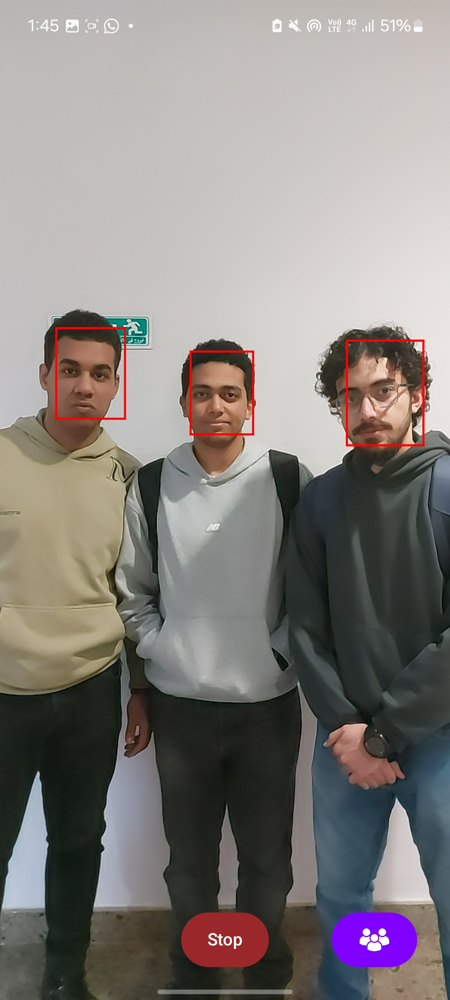
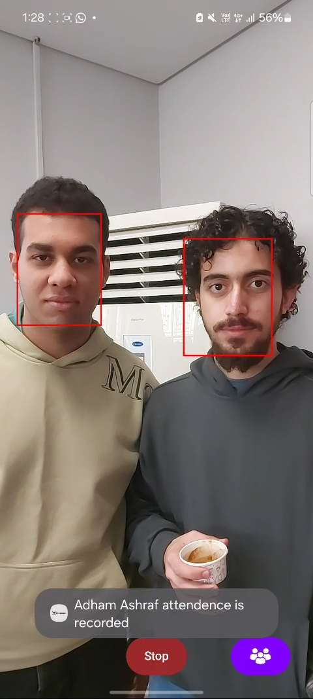
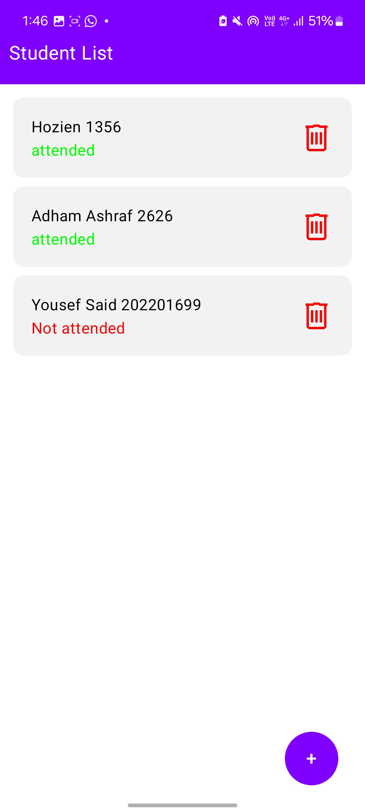
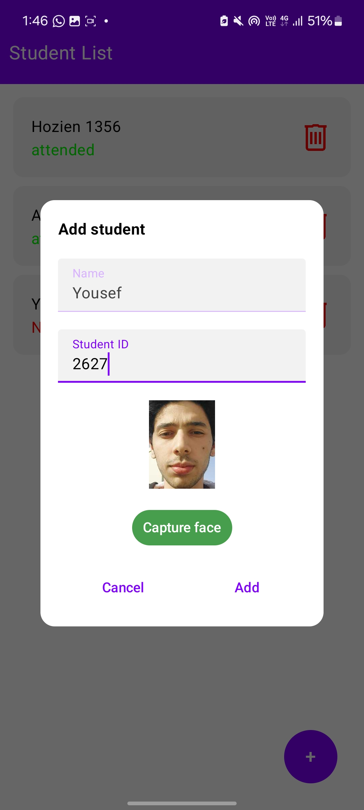

# FacePresence Android App

FacePresence is an Android application designed for attendance recording using facial recognition. The app uses TensorFlow Lite for face recognition and employs Room Database to manage and store student data, including face embeddings. It supports real-time attendance recording and student addition with a local offline database.

## Features

- **Real-time Attendance Recording**: Uses the camera to capture and recognize students' faces for attendance marking.
- **Student Management**: Allows adding students and storing their face embeddings in a local database.
- **Offline Operation**: The app works entirely offline, with no need for internet connectivity.
- **Face Detection**: Utilizes Google's ML Kit for face detection.
- **Room Database**: Stores student details and attendance data.

## Tech Stack

- **Kotlin**: Primary programming language.
- **Jetpack Compose**: For building modern UI.
- **TensorFlow Lite**: Used for face detection and machine learning tasks.
- **CameraX**: Manages camera operations.
- **Room Database**: Local database for storing student and attendance information.
- **ML Kit**: Provides face detection functionality.
- **Jetpack Navigation**: For navigation between different screens.

## Screenshots

Here are some screenshots of the app in action:

<div style="display: flex; justify-content: space-between;">
  
  
  
  
</div>

## Installation

### Prerequisites

1. Android Studio 2021 or higher.
2. Android device or emulator with a camera.

### Steps to Install

1. Clone this repository:

    ```bash
    git clone https://github.com/your-username/FacePresence.git
    cd FacePresence
    ```

2. Open the project in Android Studio.

3. Ensure that you have the required permissions configured in your Android device/emulator for using the camera.

4. Build and run the app on your Android device or emulator.

## Permissions

The app requires the following permissions:

- **Camera**: For capturing student faces.

Ensure that the required permission is granted at runtime.

## Database

The app uses **Room Database** for managing students and their attendance data. The `AppDatabase` class is used to interact with the database.

- **StudentDao**: Interface for CRUD operations on students.

## Components

### 1. MainActivity

The `MainActivity` serves as the entry point of the app, checking and requesting the necessary camera permission before navigating to different screens.

- It initializes the Room Database and resets the attendance for all students.
- Requests permission for camera access using `ActivityResultContracts.RequestPermission()`.

### 2. HomeScreen

The `HomeScreen` serves as the main UI where users can navigate to different functionalities (such as viewing the student list or recording attendance).

### 3. StudentListScreen

The `StudentListScreen` displays a list of students stored in the Room database and their attendance status.

### 4. Camera and Face Embedding

The app captures student faces using **CameraX** and processes them using **TensorFlow Lite** for face detection. The detected face is then stored in the database as a face embedding for future recognition.

### 5. Room Database

The app uses **Room** to persist data. It includes:

- **Student**: Represents the student entity.
- **StudentDao**: Interface for accessing the student database.
- **AppDatabase**: The database instance.

### 6. Face Detection

The app uses **ML Kit**'s face detection API to recognize faces. The face embeddings are then processed by TensorFlow Lite for further recognition and comparison.

## Building

To build the app:

1. Open `build.gradle` and ensure all dependencies are correctly listed as described in the repository.

2. Sync the project with Gradle.

3. Build the APK using Android Studio.

## License

This project is licensed under the MIT License - see the [LICENSE](LICENSE) file for details.
